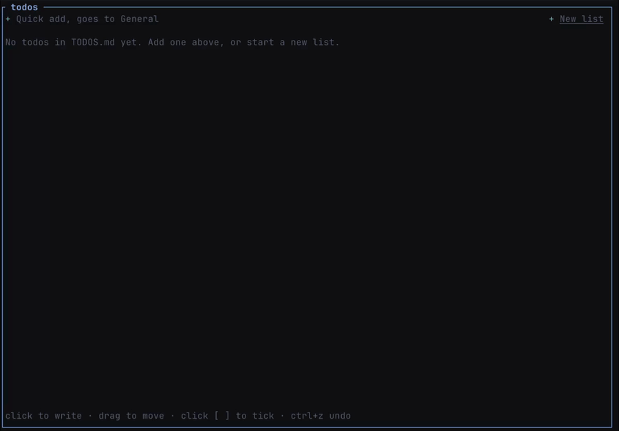

# herdr-todos

Todo lists in a [herdr](https://herdr.dev/) side panel, stored in a plain `TODOS.md` in the current folder.



## Install

```sh
herdr plugin install limonequantistico/herdr-todos   # needs a Rust toolchain
```

Bind the toggle in `~/.config/herdr/config.toml`:

```toml
[[keys.command]]
key = "prefix+t"
type = "plugin_action"
command = "herdr-todos.toggle"
```

Update: run the install again. An open panel picks up the new build on its own.

## How it works

- **One file per folder.** `TODOS.md` holds everything. No file yet? It's created on the first add.
- **Plain markdown.** `##` headings are lists, `- [ ]` / `- [x]` bullets are todos, indented bullets are sub-items. Hand-written files work as they are; anything else in the file is left alone.
- **Done.** Ticked todos move to a **Done** list at the bottom. Untick one and it goes back to the list it came from.

## Mouse

| Do | To |
|---|---|
| Click the box | tick / untick |
| Click the text | edit it |
| Drag the grip | reorder, or move to another list |
| Drag a list's name or dot | reorder lists |
| Click a list name | rename it |
| Click a list's dot | change its colour, or delete the list |
| `+ Add a to-do` / `+ New list` | add |

## Keys

You don't need to memorize these: the panel's bottom line shows the keys for whatever you're doing (browsing, adding, editing, naming a list).

| Key | Action |
|---|---|
| `a` | quick add (goes to General) |
| `n` / `l` | new todo / new list |
| `j` `k` / `↑` `↓` | move selection |
| `Space` / `x` | tick |
| `Enter` / `e` | edit |
| `J` / `K` | move todo down / up |
| `Tab` / `Shift+Tab` | nest / un-nest |
| `Delete` | delete todo |
| `Ctrl+Z` / `Ctrl+Y` | undo / redo |
| `r` | reload from disk |
| `t` | switch theme |
| `q` | quit |

While editing: `Enter` saves and starts the next todo, `Esc` stops.

## License

[MIT](LICENSE)
